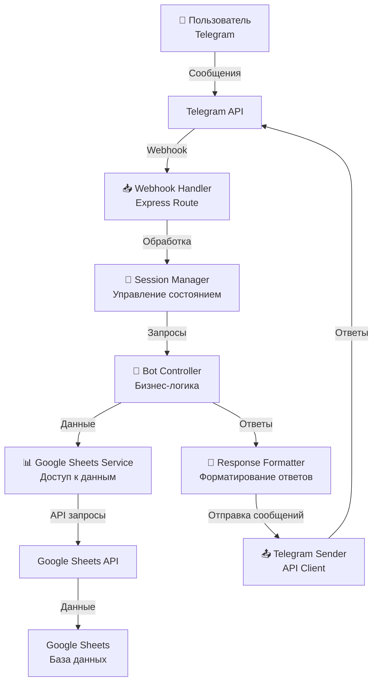

# План реализации проекта

## Основная архитектура



## Структура проекта

```
/src
  /api
    /webhook.js        # Обработчик webhook от Telegram
    /health.js         # Endpoint для проверки работоспособности
  /controllers
    /telegram
      /index.js        # Точка входа контроллера
      /stateMachine.js # Реализация конечного автомата
      /sessionManager.js # Управление пользовательскими сессиями
      /states          # Классы состояний
        /baseState.js  # Базовый класс состояния
        /noneState.js  # Начальное состояние
        /reportState.js # Состояние создания отчета
        # ... другие состояния
  /services
    /sheets
      /index.js        # Точка входа сервиса
      /sheetsRepository.js # Основная реализация
      /cacheManager.js # Управление кэшем
      /errorHandler.js # Обработка ошибок API
      /models          # Модели данных
  /utils
    /logger.js         # Утилита для логирования
    /config.js         # Конфигурация приложения
  /index.js            # Точка входа приложения
```

## Этапы реализации

### 1. Настройка основного проекта (2 дня)
- [ ] Создание структуры директорий
- [ ] Настройка package.json
- [ ] Настройка ESLint и Prettier
- [ ] Настройка конфигурации через dotenv
- [ ] Создание базового Express сервера

### 2. Реализация Google Sheets сервиса (3 дня)
- [ ] Создание интерфейса репозитория
- [ ] Реализация механизма кэширования
- [ ] Реализация методов для работы с данными
- [ ] Обработка ошибок и повторные попытки
- [ ] Написание модульных тестов

### 3. Реализация контроллера Telegram бота (4 дня)
- [ ] Создание менеджера пользовательских сессий
- [ ] Реализация базового класса состояния
- [ ] Реализация машины состояний
- [ ] Реализация состояний для основных сценариев
- [ ] Реализация обработчика webhook

### 4. Интеграция компонентов (2 дня)
- [ ] Соединение контроллера с сервисом Google Sheets
- [ ] Настройка маршрутизации в Express
- [ ] Реализация механизма восстановления сессий
- [ ] Настройка логирования и мониторинга

### 5. Тестирование (2 дня)
- [ ] Написание интеграционных тестов
- [ ] Ручное тестирование основных сценариев
- [ ] Проверка обработки ошибок
- [ ] Оптимизация производительности

### 6. Деплой и настройка (1 день)
- [ ] Настройка GitHub репозитория
- [ ] Настройка проекта на Render.com
- [ ] Настройка переменных окружения
- [ ] Настройка webhook для Telegram бота

## Детали реализации ключевых компонентов

### Google Sheets Repository

```javascript
class SheetsRepository {
  constructor(auth, spreadsheetId, cacheManager) {
    this.sheetsClient = google.sheets({ version: 'v4', auth });
    this.spreadsheetId = spreadsheetId;
    this.cache = cacheManager;
  }
  
  async getData(range, forceRefresh = false) {
    const cacheKey = `sheets_${this.spreadsheetId}_${range}`;
    
    if (!forceRefresh) {
      const cachedData = await this.cache.get(cacheKey);
      if (cachedData) return cachedData;
    }
    
    const data = await this._fetchFromAPI(range);
    await this.cache.set(cacheKey, data, 300); // 5 минут
    
    return data;
  }
  
  async saveReport(reportData) {
    // Реализация сохранения отчета
  }
  
  async getLastReport(userId) {
    // Реализация получения последнего отчета
  }
  
  async getUserStats(userId) {
    // Реализация получения статистики
  }
}
```

### State Machine и базовый класс состояния

```javascript
class StateMachine {
  constructor() {
    this.states = {};
    this.transitions = {};
  }
  
  registerState(state) {
    this.states[state.name] = state;
    return this;
  }
  
  addTransition(fromState, event, toState) {
    if (!this.transitions[fromState]) {
      this.transitions[fromState] = {};
    }
    this.transitions[fromState][event] = toState;
    return this;
  }
  
  // ... другие методы
}

class BaseState {
  constructor(name) {
    this.name = name;
  }
  
  async enter(ctx) {
    // Метод вызывается при входе в состояние
  }
  
  async handle(ctx) {
    // Метод обработки сообщения
    throw new Error('Not implemented');
  }
  
  async exit(ctx) {
    // Метод вызывается при выходе из состояния
  }
}
```

## Обработка ошибок

Для обработки ошибок будет использован следующий подход:
1. Создание пользовательских классов ошибок для разных типов
2. Централизованная обработка в middleware Express
3. Автоматические повторные попытки для временных ошибок
4. Логирование всех ошибок с контекстом

```javascript
// Пример обработчика ошибок
app.use((err, req, res, next) => {
  logger.error(`Error processing request: ${err.message}`, { 
    stack: err.stack,
    path: req.path,
    method: req.method
  });
  
  res.status(err.statusCode || 500).json({
    success: false,
    message: err.publicMessage || 'Internal server error'
  });
});
```

## Зависимости проекта

```json
{
  "name": "weekly-reports-bot",
  "version": "1.0.0",
  "description": "Telegram bot for weekly reports with Google Sheets integration",
  "main": "src/index.js",
  "scripts": {
    "start": "node src/index.js",
    "dev": "nodemon src/index.js",
    "lint": "eslint .",
    "test": "jest"
  },
  "dependencies": {
    "axios": "^1.10.0",
    "dotenv": "^16.3.1",
    "express": "^4.18.2",
    "googleapis": "^128.0.0",
    "node-telegram-bot-api": "^0.64.0",
    "winston": "^3.10.0"
  },
  "devDependencies": {
    "eslint": "^8.51.0",
    "jest": "^29.7.0",
    "nodemon": "^3.0.1"
  },
  "engines": {
    "node": "18.x"
  }
}
```

## Мониторинг и логирование

Для мониторинга и логирования будет использоваться библиотека Winston с следующей конфигурацией:

```javascript
const winston = require('winston');

const logger = winston.createLogger({
  level: process.env.LOG_LEVEL || 'info',
  format: winston.format.combine(
    winston.format.timestamp(),
    winston.format.json()
  ),
  transports: [
    new winston.transports.Console(),
    new winston.transports.File({ filename: 'logs/error.log', level: 'error' }),
    new winston.transports.File({ filename: 'logs/combined.log' })
  ]
});

module.exports = logger;
```

## График реализации

| Неделя | День | Задачи |
|-------|------|--------|
| 1 | 1-2 | Настройка основного проекта |
| 1 | 3-5 | Реализация Google Sheets сервиса |
| 2 | 1-4 | Реализация контроллера Telegram бота |
| 2 | 5 | Начало интеграции компонентов |
| 3 | 1-2 | Завершение интеграции компонентов |
| 3 | 3-4 | Тестирование |
| 3 | 5 | Деплой и настройка | 